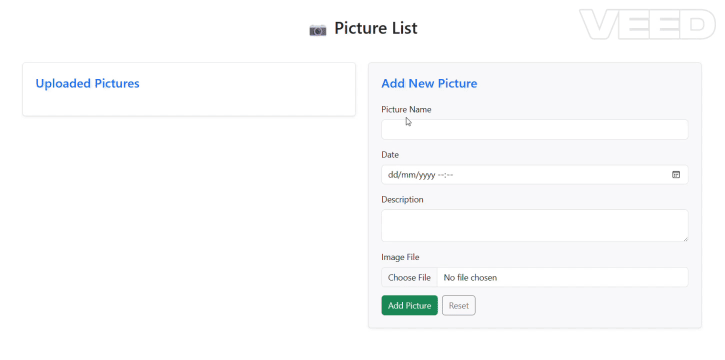

# 📷 Personal Pictures System

A full-stack web-based application to upload and manage personal pictures. Built with:

- **Frontend**: React + Bootstrap
- **Backend**: .NET 9 WebAPI + Entity Framework Core
- **Database**: SQL Server
- **DevOps**: Docker & Docker Compose

---

## Project Demo




## ✨ Features

- Upload picture files with metadata (name, date, description)
- Display list of uploaded pictures
- Validation and error handling
- Reset form with confirmation
- Responsive UI using Bootstrap
- Dockerized: API, DB, and frontend run in containers

## 📦 Frontend Structure
```
frontend-react/
├── src/
│   ├── api/
│   │   └── picturesApi.ts
│   ├── components/
│   │   ├── PictureForm.tsx
│   │   └── PictureList.tsx
│   └── App.tsx
├── public/
│   └── index.html
├── index.tsx
└── package.json
```

## 🗂️ Backend Structure
```
backend/
├── Pictures.Api/             # Presentation layer (Web API)
├── Pictures.Application/     # Application layer (services, interfaces, DTOs)
├── Pictures.Domain/          # Core business logic (entities, domain services)
└── Pictures.Infrastructure/  # Infrastructure (EF Core DbContext, repositories)
```

## 🗂️ Simple Diagram
---
```
               ┌───────────────────────┐
               │      Pictures.Api     │
               │  (Presentation Layer) │
               └───────────┬───────────┘
                           │ calls
                           ▼
               ┌─────────────────────────┐                   ┌──────────────────────────┐
               │   Pictures.Application  │     uses  >       │     Pictures.Domain      │
               │    (Application Layer)  │                   │ (Domain Layer: Entities) │
               └───────────┬─────────────┘                   └──────────────────────────┘
                           │ calls
                           ▼
               ┌──────────────────────────┐
               │  Pictures.Infrastructure │
               │ (Infrastructure Layer)   │
               └──────────────────────────┘
                           
```

## 🚀 How to Run Using Docker Compose

Ensure you have a working Docker environment, then:

1. Clone the project:
```bash
git clone https://github.com/jacobmousa/pictures.git
cd pictures
```

2. Start the full stack using Docker Compose:
```bash
docker-compose up --build
```

Run this to apply EF Core migrations and create the tables:
```bash
docker exec -it pictures-api dotnet ef database update --project ../Pictures.Infrastructure --startup-project .
```

## 🖼️ Usefull Hints

# Run frontend (React)
```bash
cd pictures-frontend
npm install
npm run dev
```
# Run DotNet
```bash
cd backend
dotnet run
```
